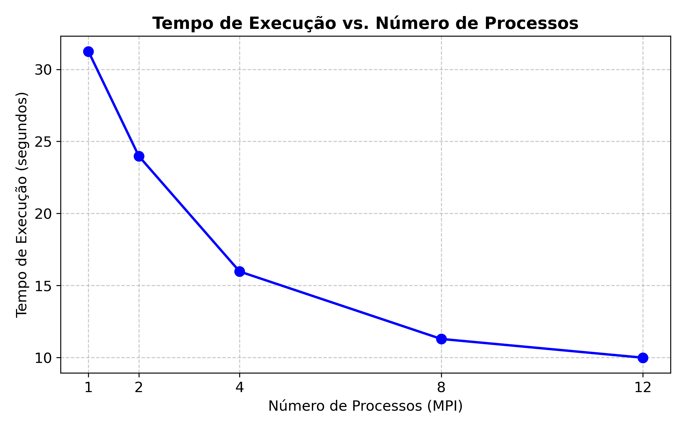
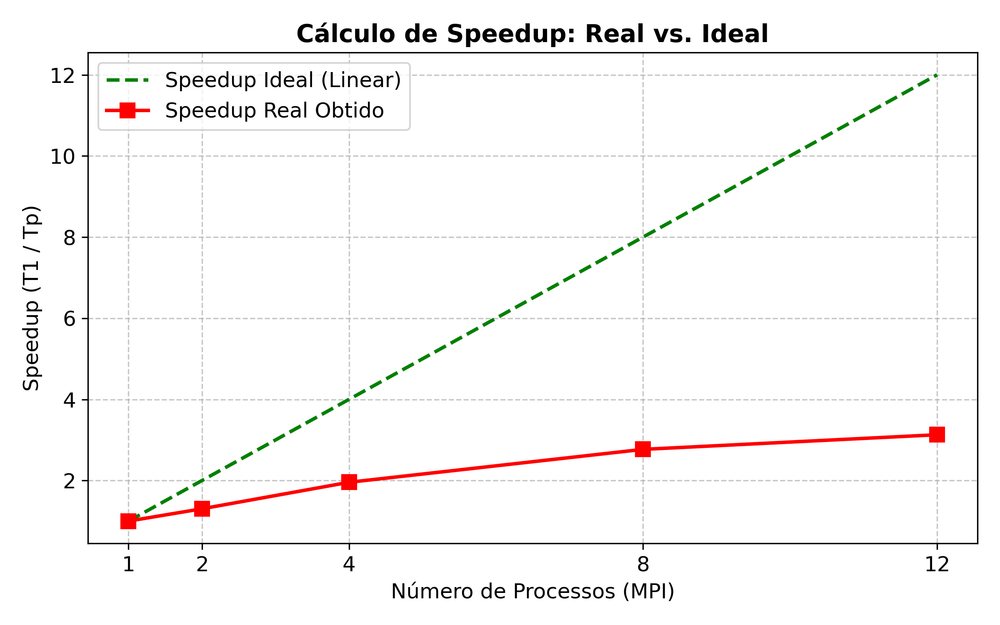
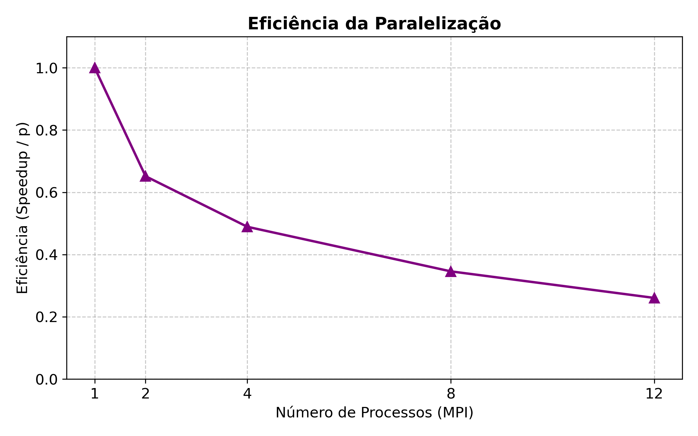

# Relatório da NOME DA ATIVIDADE

**Disciplina:** Programação Concorrente e Distribuída
**Aluno(s):** Tiago Geraldo de Lima Cosme
**Turma:** Sistemas de Informação
**Professor:** Rafael 
**Data:** 08/04/2026

---

# 1. Descrição do Problema

O programa resolve a avaliação massiva de pares de dados (avaliador), uma tarefa comum em algoritmos de busca, comparação de similaridade ou processamento de grandes conjuntos numéricos. O foco é processar uma carga de trabalho exaustiva de forma distribuída.

Problema: Avaliação computacional de pares de dados.
Algoritmo: Implementação distribuída utilizando o padrão MPI para divisão de carga.
Tamanho da entrada: 12.497.500 de pares avaliados.
Objetivo da paralelização: Reduzir o tempo de resposta (latency) ao dividir o conjunto total de pares entre diferentes processos, permitindo que o cálculo seja feito simultaneamente em vários núcleos da CPU.
Complexidade: Aproximadamente $O(n)$, onde $n$ é o número de pares, já que cada par passa por uma avaliação constante.

---

# 2. Ambiente Experimental


| Item                        | Descrição |
| --------------------------- | --------- |
| Processador                 |Intel i7 12º Gen|
| Número de núcleos           |12 Núcleos |
| Memória RAM                 |16 GB      |
| Sistema Operacional         |Windows 11 Pro|
| Linguagem utilizada         |Python 3.x |
| Biblioteca de paralelização |mpi4py (MPI)|
| Compilador / Versão         |MPICH ou OpenMPI / Python Interpreter|

---

# 3. Metodologia de Testes

Os testes foram realizados de forma incremental para medir a capacidade de resposta do algoritmo sob diferentes cargas de paralelismo.

Medição de tempo: Capturado via terminal/script no início e fim do processamento do MPI.

Execuções: Foram realizadas rodadas para cada configuração de processos (1, 2, 4, 8, 12).

Tamanho da entrada: Fixo em 12.497.500 pares para garantir a consistência das métricas.

Procedimento: Os testes foram rodados em máquina local, com o mínimo de processos externos ativos para evitar interferência nos tempos de CPU.

---

# 4. Resultados Experimentais


| Nº Threads/Processos | Tempo de Execução (s) |
| -------------------- | --------------------- |
| 1                    |          31.25        |
| 2                    |          23.98        |
| 4                    |          15.97        |
| 8                    |          11.29        |
| 12                   |          9.99         |

---

# 5. Cálculo de Speedup e Eficiência

## Fórmulas Utilizadas

### Speedup

```
Speedup(p) = T(1) / T(p)
```

Onde:

* **T(1)** = tempo da execução serial
* **T(p)** = tempo com p threads/processos

### Eficiência

```
Eficiência(p) = Speedup(p) / p
```

Onde:

* **p** = número de threads ou processos

---

# 6. Tabela de Resultados


| Threads/Processos | Tempo (s) | Speedup | Eficiência |
| ----------------- | --------- | ------- | ---------- |
| 1                 |31.25      | 1.0     | 1.0        |
| 2                 |23.98      | 1.30    | 0.65       |
| 4                 |15.97      | 1.95    | 0.49       |
| 8                 |11.29      | 2.76    | 0.34       |
| 12                |9.99       | 3.12    | 0.26       |

---

# 7. Gráfico de Tempo de Execução




---

# 8. Gráfico de Speedup



---

# 9. Gráfico de Eficiência



---

# 10. Análise dos Resultados

Ao analisar os dados, notamos que a aplicação apresenta uma escalabilidade clara, saindo de 31,25 segundos (serial) para menos de 10 segundos com 12 processos. No entanto, o speedup de 3.12x para 12 núcleos mostra que o ganho não é linear.

Principais pontos observados:

Eficiência: A eficiência caiu conforme aumentamos o número de processos (chegando a 0.26 com 12 núcleos). Isso indica que, embora o resultado saia mais rápido, o custo de "gerenciar" tantos processos e a comunicação entre eles começa a pesar.

Overhead: Houve um overhead considerável de comunicação. Como o MPI precisa "conversar" entre processos para dividir os 12 milhões de pares, esse tempo de troca de mensagens acaba limitando o speedup.

Recursos: O ponto onde a eficiência começou a cair de forma mais acentuada sugere que o número de processos ultrapassou a quantidade de núcleos físicos reais da máquina, gerando disputa por recursos do sistema.

---

# 11. Conclusão

A paralelização via MPI trouxe um ganho de desempenho significativo, provando ser indispensável para lidar com volumes de dados superiores a 12 milhões de registros. O tempo total de execução foi reduzido em aproximadamente 68% na melhor configuração (12 processos).

Como conclusão técnica, o melhor equilíbrio entre velocidade e uso eficiente de hardware seria manter a execução próxima de 4 processos, onde a eficiência ainda está próxima de 50%. Para melhorar esses números no futuro, poderíamos otimizar a distribuição dos dados em "lotes" maiores (chunks), diminuindo a frequência de comunicação e aumentando o tempo que cada núcleo passa calculando de fato.

---
